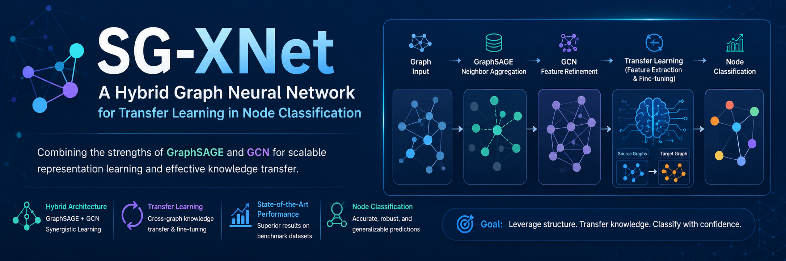

<div align="center">



# SG-XNet

### A Hybrid Graph Neural Network for Transfer Learning in Node Classification


---

**Research Repository**

Architecture • Methodology • Experimental Results

</div>

---

# 📌 Research Status

This repository presents the **architecture, methodology, and summarized experimental results** of **SG-XNet**, a hybrid Graph Neural Network designed for transfer learning in node classification.

> **Note**
>
> The accompanying manuscript has **not yet been formally published**. Therefore, the complete implementation, trained models, and manuscript are intentionally withheld until completion of the publication process.

---

# 📖 Overview

SG-XNet is a hybrid Graph Neural Network framework that combines the inductive representation learning capability of **GraphSAGE** with the feature refinement ability of **Graph Convolutional Networks (GCN)**.

The framework is specifically designed to improve **transfer learning** across graph datasets where labeled data is limited. By integrating neighborhood aggregation, graph convolution, and transfer learning strategies, SG-XNet aims to produce more robust node representations while improving classification performance on target domains.

---

# 🎯 Motivation

Although Graph Neural Networks have achieved remarkable success, transferring learned knowledge between graph datasets remains challenging.

SG-XNet addresses this challenge by integrating:

- GraphSAGE for inductive neighborhood aggregation
- Graph Convolutional Networks for feature refinement
- Feature Extraction transfer learning
- Fine-Tuning transfer learning

The proposed framework seeks to improve knowledge transfer while maintaining strong node classification performance across benchmark citation networks.

---

# ✨ Key Contributions

- Proposed **SG-XNet**, a hybrid GraphSAGE-GCN architecture for graph transfer learning.
- Combined inductive representation learning with graph convolution.
- Investigated Feature Extraction and Fine-Tuning transfer learning strategies.
- Evaluated the framework on multiple benchmark citation graph datasets.
- Conducted comprehensive experimental evaluation and ablation analysis.

---

# 📂 Repository Structure

```
SG-XNet
│
├── assets/
│   ├── Proposed Model/
│     └── SG-XNet.png
│
│   ├── Methodology/
│     └── Research Methodology.png
│
│   ├── results/
│     └── Ablation Study Results.png
│     └── Citeseer & Cora Feature Extraction.png
│     └── Citeseer & Cora Finetuned.png
│     └── DBLP & PubMED Feature Extraction.png
│     └── DBLP & PubMED Finetuned.png
│
│   └── banner.png
│
└── README.md
```

---

# 🏗 Proposed Architecture

<p align="center">

</p>

The proposed SG-XNet architecture combines **GraphSAGE** and **Graph Convolutional Networks (GCN)** to leverage the strengths of both models for transfer learning.

The workflow consists of:

- Graph representation learning
- Neighborhood aggregation
- Feature refinement
- Transfer learning
- Node classification

---

# 🔬 Methodology

<p align="center">

</p>

SG-XNet follows a three-stage learning framework.

### Stage 1 — Graph Representation Learning

GraphSAGE learns inductive node embeddings through neighborhood sampling and aggregation.

### Stage 2 — Feature Refinement

Graph Convolutional Networks refine node representations using graph topology.

### Stage 3 — Transfer Learning

Knowledge is transferred using:

- Feature Extraction
- Fine-Tuning

before performing node classification on the target graph.

---

# 🧪 Experimental Evaluation

## Benchmark Datasets

- Cora
- CiteSeer
- DBLP
- PubMed

## Evaluation Metrics

- Accuracy
- Precision
- Recall
- F1-Score
- Transfer Ratio

## Transfer Learning Strategies

- Feature Extraction
- Fine-Tuning

---

# 📊 Experimental Results

## Accuracy Comparison

<p align="center">


</p>

The proposed SG-XNet framework demonstrates competitive performance across multiple graph datasets while effectively transferring knowledge between source and target domains.

---

## Performance Comparison
The experimental evaluation compares SG-XNet with established Graph Neural Network architectures, including GraphSAGE, GCN, GAT, and GIN.

---

# 📈 Ablation Study

<p align="center">

</p>

The ablation study investigates the contribution of each major component of SG-XNet and highlights the importance of combining GraphSAGE with GCN for effective transfer learning.

---

# 🏆 Key Findings

- Hybrid GraphSAGE-GCN learning improves graph transfer learning performance.
- Graph convolution effectively refines transferred node representations.
- SG-XNet performs competitively across benchmark citation datasets.
- Fine-Tuning demonstrates improved adaptation to target graph domains.
- The hybrid framework exhibits strong generalization capability.

---

# 🚀 Future Work

Future extensions of SG-XNet include:

- Graph Attention Network (GAT) integration
- Self-supervised graph learning
- Heterogeneous graph representation learning
- Dynamic graph transfer learning
- Evaluation on larger real-world graph datasets

---

# 👥 Authors

**Raheel Khan [1]**
**Muhammad Wasim [1,2]**
**Adnan Khan [3]**
**Saad Alahmari [4]**

---

# 📄 Citation

The manuscript associated with SG-XNet has **not yet been formally published**.

Citation information will be added once the paper has been published.

---

# 📜 License

This repository is provided for **research and academic showcase purposes only**.

All rights to the research content remain with the respective authors unless otherwise stated.

---

# ⚠️ Disclaimer

This repository shares only the conceptual framework, methodology, architecture, and summarized experimental findings of SG-XNet.

The implementation, trained models, datasets, and complete manuscript are intentionally withheld while the work progresses through the publication process.

---

<div align="center">

### ⭐ If you find this research interesting, please consider starring this repository.

</div>
